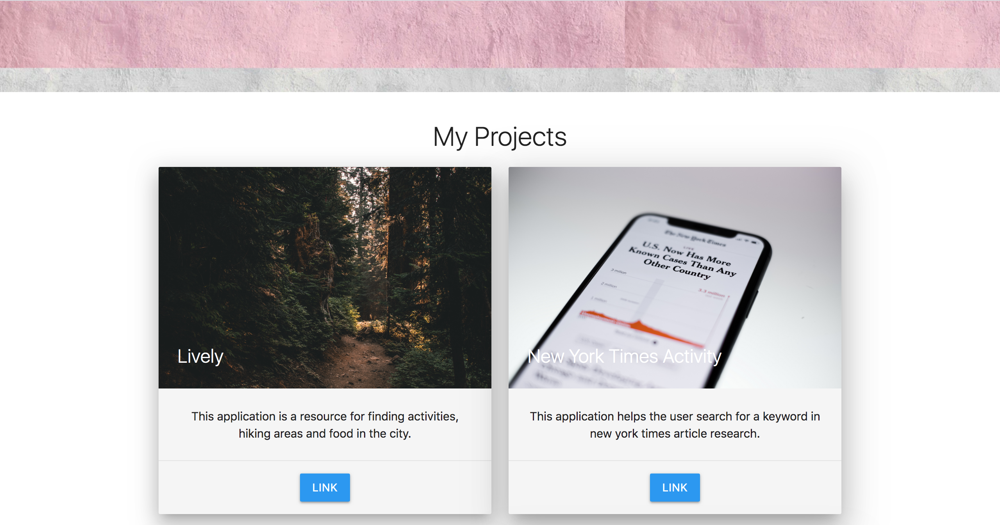
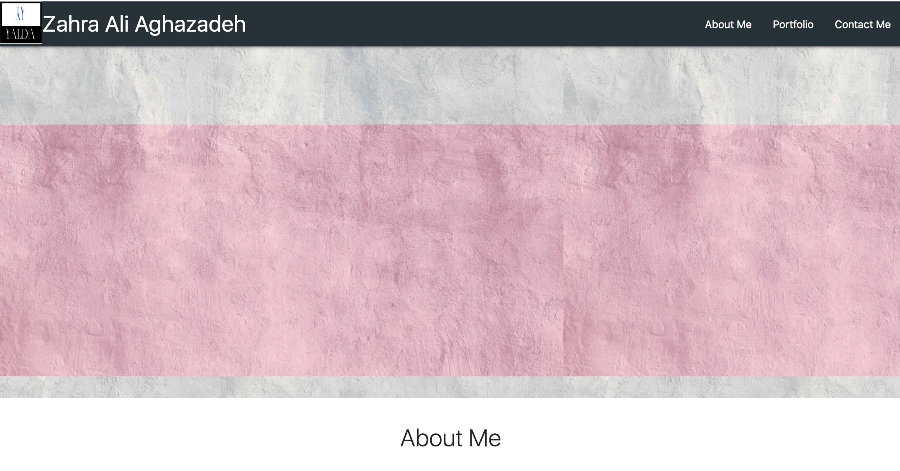

# Project Name
> Here goes your awesome project description!

## Table of contents
* [General-info](#General-info)
* [Questions](#questions)
* [Screenshots](#screenshots)
* [Technologies](#technologies)
* [Setup](#setup)
* [Features](#features)
* [Status](#status)
* [Inspiration](#inspiration)
* [Contact](#contact)

## General-info:
html and css based portfolio page.

# Questions
* What was the most challenging piece of this assignment? 
The grid system was not cooperating with me.
 Did you find it easy or challenging to work with HTML and CSS? 
It is not too challenging.
  How long did this overall assignment take you?
  a day.
* What decisions did you make when you made your site mobile friendly?
I added a hamburger menu in the navbar and also added some media queries
I made the decision for screen size by doing some research.
* What did you take into account when you developed the design of your website?  Is there anything that you’re particularly proud of?
This could have definitely be a better project if I spend more time on it.
* Given more time or resources, what additional features would you add to your site in the future? 
I can add animations and better design.
How many hours did you spend on this assignment?
a day

## Screenshots
<!-- 
 -->

## Technologies
* HTML5
* CSS3

## Setup
To view this portfolio you can click : [here](https://zahraaliaghazadeh.github.io)

## Features
* feature 1: This code has the responsive ability, it can customize its sizes depending on changes to the screen.
* feature 2: responsive tabs to open once clicked for portfolio and contact me.

To-do list:
* improvement to be done 1: make the looks of it better by finding better colors and alignment of photos and texts.
* improvement to be done 2: has to improve in terms of adjusting the screen size.

## Status
Portfolio is: _in progress_, as there will be more projects in the course to be added.

## Inspiration
A start to having an outstanding portfolio has been the inspiration.

## Contact
Email: zahraaliaghazadeh@gmail.com

LinkedIn: [LinkedIn](https://www.linkedin.com/in/zahraaliaghazadeh/)

feel free to contact me!

